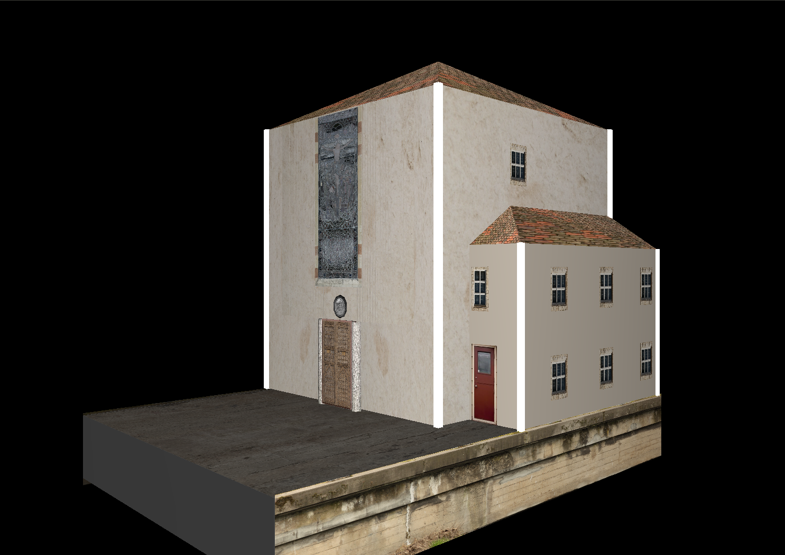
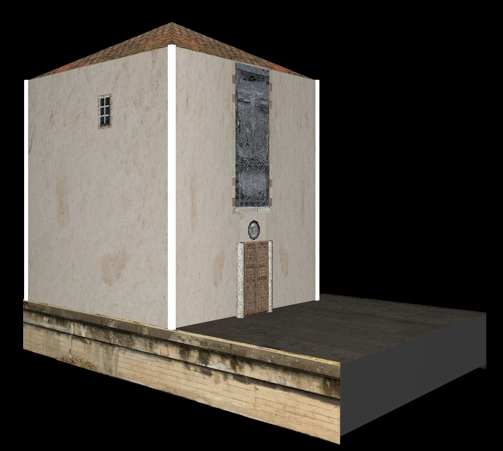
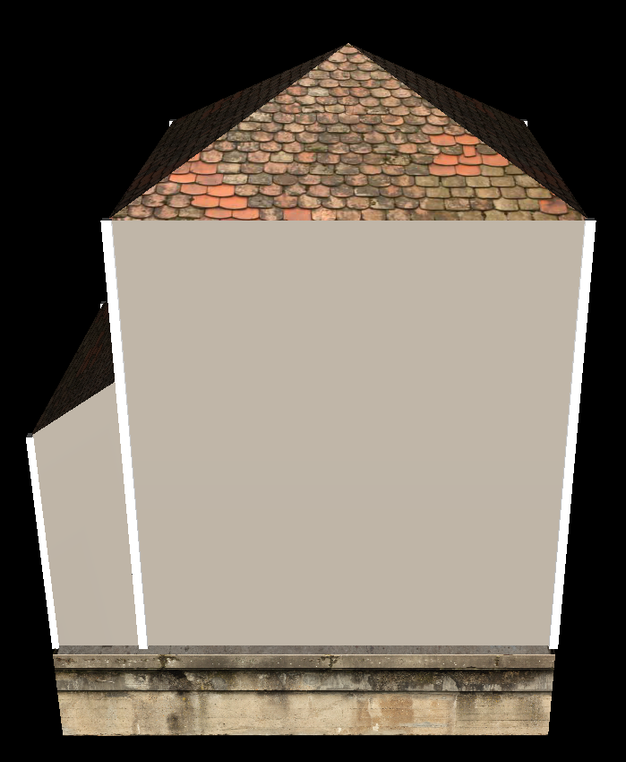
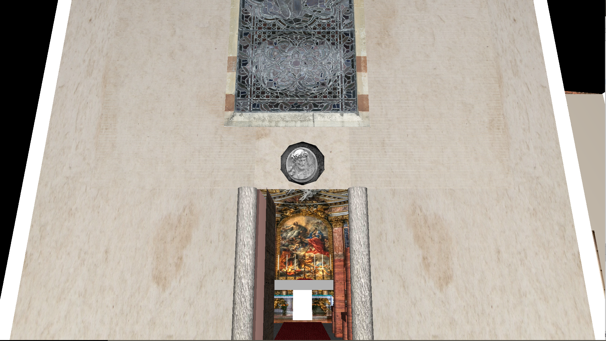
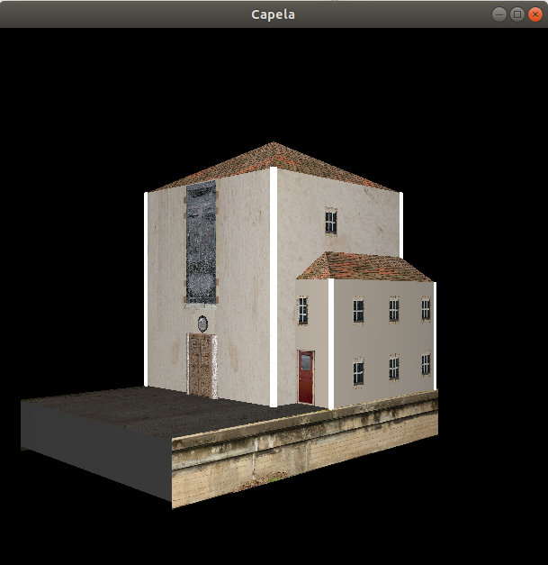

# Rendering - Capela 
## Computação Gráfica
Modelagem da capela dos alfaiates usando Computação Gŕafica (OpenGL).

This project models the Capela dos Alfaiates (Porto - Portugal), using JOGL in a Maven Java project.

## Texturing, lighting, mouse and keyboard controls.
* O - Opens the door
* C - Closes the door
* Zoom - Mouse Wheel
* Rotation - Arrow Keys

## Referências
* [Red Book](https://www.glprogramming.com/red)
* http://jerome.jouvie.free.fr/opengl-tutorials/Tutorial14.php

## Highlights

